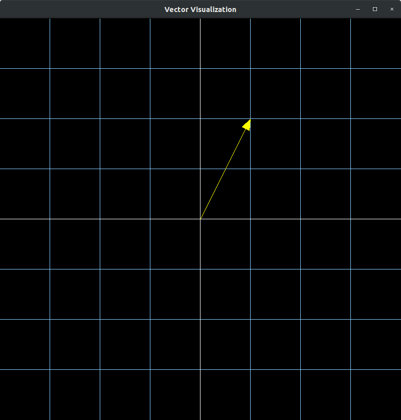

Hey there

This is a visualization tool for vectors and matrix transformations. 

It's in the early stages right now. It was very heavily inspired [by a video series on linear algebra by 3Blue1Brown on youtube.](https://www.youtube.com/playlist?list=PLZHQObOWTQDPD3MizzM2xVFitgF8hE_ab)

I would highly recommend anyone interested in math or cs to watch not only this series but his entire channel.

It depends on [SFML](https://www.sfml-dev.org/) for c++ for the graphics.

Here's a screenshot of what there is so far.
